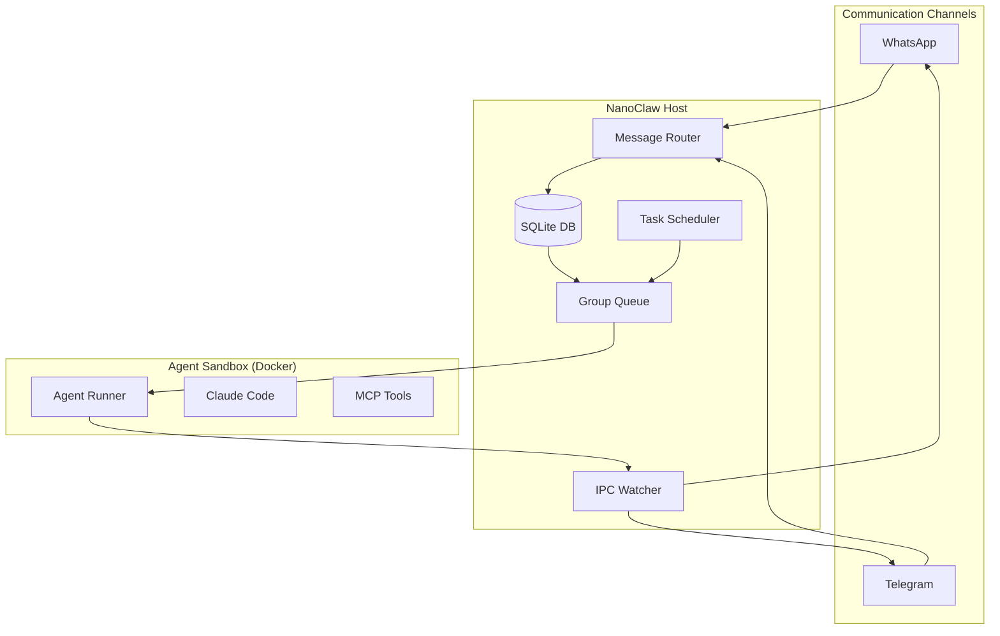
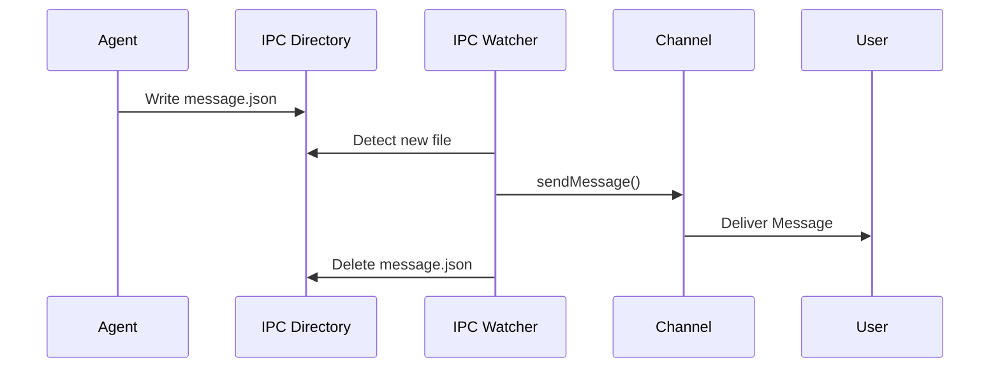

# NanoClaw Architecture

NanoClaw is a multi-channel agent platform designed to run LLM-powered agents in isolated environments. It features a unique "Skills Architecture" that allows for programmatic, auditable codebase modifications.

## System Overview

NanoClaw acts as a bridge between communication channels (WhatsApp, Telegram) and autonomous agents running in Docker containers.



## Core Components

### 1. Message Routing & Persistence
- **Channels**: Handles integration with WhatsApp and Telegram. See [Channels Documentation](architecture/channels.md).
- **Database**: Uses SQLite to store all incoming/outgoing messages, chat metadata, and system state. See [Database Documentation](architecture/database.md).
- **Message Loop**: Polls the database for new messages and routes them to the appropriate group queue. See [Message Loop Documentation](architecture/message-loop.md).

### 2. Agent Execution Environment
- **Containerization**: Agents run in Docker containers. See [Container Runner Documentation](architecture/container-runner.md).
- **Agent Runner**: The code executing inside the container. See [Agent Runner Documentation](architecture/agent-runner.md).
- **Isolation**: Each chat group has its own isolated environment (working directory, IPC namespace, session state).
- **Security**: Application source code is mounted read-only; secrets are passed via `stdin`.

### 3. Group Queue & Process Management
- **Concurrency**: Ensures only one agent process runs per group at a time. See [Group Queue Documentation](architecture/group-queue.md).
- **Message Piping**: Pipes new messages to active containers via `stdin`.
- **Idle Management**: Reaps containers after inactivity.

### 4. IPC Mechanism
- **File-based IPC**: Communication via a shared IPC directory. See [IPC Mechanism Documentation](architecture/ipc-mechanism.md).
- **Capabilities**: Message sending, task scheduling, group registration.

### 5. Task Scheduler
- **Recurring Tasks**: [`src/task-scheduler.ts`](src/task-scheduler.ts) allows agents to schedule future executions (e.g., daily reports, reminders).
- **Persistence**: Tasks are stored in the database and survive system restarts.

---

## File Structure

The project is organized into several key directories:

- `src/`: Core host application logic (TypeScript).
    - `channels/`: Messaging platform integrations.
- `container/`: Docker configuration and agent-side code.
    - `agent-runner/`: Code that runs inside the agent container.
    - `skills/`: MCP tools available to the agent.
- `agents/`: System prompts and configurations for different agent types (e.g., deep-research, finance-reviewer).
- `docs/`: Technical specifications and architecture design documents.
- `roo-docs/`: User-facing and high-level architecture documentation.
- `skills-engine/`: Tooling for applying and managing "Skills" (codebase modifications).
- `scripts/`: Maintenance and CI/CD scripts.
- `setup/`: Initialization and environment configuration logic.
- `groups/`: (Generated) Writable directories for each registered chat group.
- `data/`: (Generated) Persistent storage for SQLite database, logs, and session state.

---

## Skills Architecture

NanoClaw uses a "Skills" system for extending functionality. Unlike traditional plugin systems, skills modify the actual codebase using git-based mechanics.

### Core Principles
1. **Git-based Merges**: Uses `git merge-file` for code changes and `git rerere` for conflict resolution caching.
2. **Three-Level Resolution**:
    - **Level 1 (Git)**: Deterministic, programmatic merge.
    - **Level 2 (Claude Code)**: AI-assisted resolution using `.intent.md` files.
    - **Level 3 (User)**: Human intervention for ambiguous conflicts.
3. **Shared Base**: `.nanoclaw/base/` maintains a clean copy of the core for stable three-way merges.
4. **Structured Operations**: Non-code files (like `package.json` or `.env`) are modified via deterministic aggregators rather than text merges.

### Skill Structure
```text
skills/add-feature/
├── SKILL.md           # Intent and documentation
├── manifest.yaml      # Metadata and dependencies
├── add/               # New files to be added
└── modify/            # Existing files to be modified (full versions)
    ├── src/app.ts
    └── src/app.ts.intent.md
```

---

## Data Flow: Inbound Message

```mermaid
sequenceDiagram
    participant User
    participant Channel
    participant DB
    participant Loop as Message Loop
    participant Queue
    participant Container

    User->>Channel: Sends Message
    Channel->>DB: storeMessage()
    Loop->>DB: getNewMessages()
    DB-->>Loop: Messages
    Loop->>Queue: sendMessage() / enqueue()
    alt Container Active
        Queue->>Container: Pipe to stdin
    else Container Idle
        Queue->>Container: spawn(docker run)
        Container->>Container: Initialize Agent
    end
    Container->>Container: Process with LLM
```

## Data Flow: Outbound Message (IPC)


