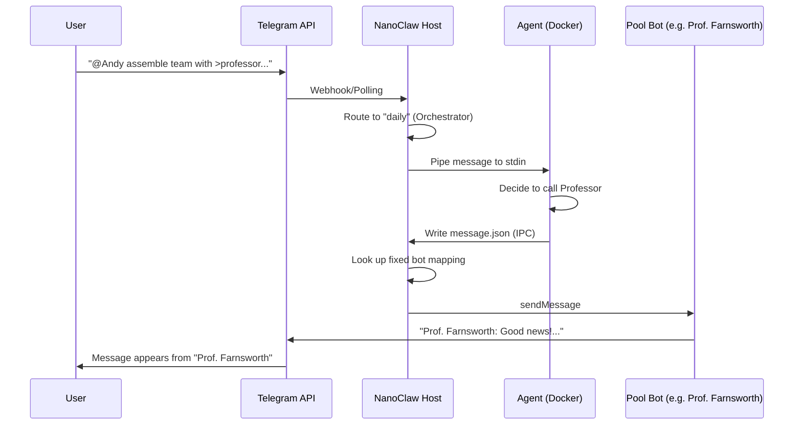

# NanoClaw User Guide (Telegram)

NanoClaw is an LLM-powered agent platform that brings autonomous agents into your Telegram chats. This guide explains how to interact with the agents, manage groups, and use advanced features like agent teams.

---

## 🚀 Getting Started

### 1. Get Your Chat ID
To register a chat (group or private) with NanoClaw, you first need its unique ID.
1. Add the main NanoClaw bot to your group (or start a private chat with it).
2. Send the command: `/chatid`
3. The bot will reply with a registration ID (e.g., `tg:-100123456789`).

### 2. Register the Chat
Once you have the Chat ID, you need to register it on the host machine to enable the agent.
```bash
npm run setup:register -- \
  --jid "tg:-100123456789" \
  --name "My Project Group" \
  --folder "my-project" \
  --trigger "@Andy"
```
*   `--jid`: The ID you got from `/chatid`.
*   `--name`: A friendly name for the group.
*   `--folder`: A unique folder name for the group's data (stored in `groups/`).
*   `--trigger`: The pattern that triggers the agent (e.g., `@Andy` or `!bot`).

---

## 🤖 Interacting with Agents

### Triggering the Agent
By default, the agent only responds when triggered. You can trigger it in two ways:
1.  **Mention**: Tag the bot directly (e.g., `@your_bot_username Hello!`).
2.  **Trigger Pattern**: Use the configured trigger (e.g., `@Andy Hello!`).

### Supported Message Types
NanoClaw can "see" and process various types of messages:
*   📝 **Text**: Standard text messages.
*   🖼️ **Photos/Videos**: The agent receives a placeholder (e.g., `[Photo]`) and any accompanying caption.
*   🎙️ **Voice/Audio**: Received as `[Voice message]` or `[Audio]`.
*   📄 **Documents**: Received as `[Document: filename.pdf]`.
*   📍 **Location/Contacts**: Received as `[Location]` or `[Contact]`.
*   🎨 **Stickers**: Received as `[Sticker 🤖]`.

### Commands
*   `/ping`: Check if the bot is online.
*   `/chatid`: Get the current chat's registration ID.

---

## 🧠 Smart Routing & Personas

NanoClaw automatically routes your requests to specialized agents based on keywords or "shortcuts" (`>name`).

| Shortcut | Agent | Specialty |
| :--- | :--- | :--- |
| `>bender` (Default) | **Daily** | General tasks, coordination, and casual chat. |
| `>professor` | **Deep Research** | Comprehensive analysis and deep dives. |
| `>fry` | **Light Research** | Quick information gathering and summaries. |
| `>amy` | **Tech Reviewer** | Engineering feasibility and architectural fit. |
| `>hermes` | **Finance Reviewer** | Macro-economy and investment analysis. |
| `>zoidberg` | **Health Reviewer** | Medical mechanisms and wellbeing. |
| `>leela` | **Language Reviewer** | Grammar, style, and translation. |
| `>nibbler` | **Science Reviewer** | First-principles scientific explanations. |

**Example**: `@Andy >professor What are the implications of room-temperature superconductors?`

---

## 👥 Agent Teams (Bot Pool)

When complex tasks require multiple experts, NanoClaw can "assemble a team." This allows multiple specialized agents to collaborate in the same chat, each appearing as a **separate bot identity**.

### 1. Triggering a Team
To start a team collaboration, use one of the following trigger phrases with the default agent (Bender):
*   `@Andy assemble a team of >professor and >amy to review...`
*   `@Andy assemble team...`
*   `@Andy team of...`

When these phrases are detected, the **Daily Agent (Bender)** acts as the orchestrator, coordinating the other agents.

### 2. How the Bot Pool Works
NanoClaw maintains a pool of Telegram bots (configured in `TELEGRAM_BOT_POOL`). Each agent has a **fixed, deterministic bot identity** — the mapping is hardcoded in `src/channels/telegram.ts` (`AGENT_BOT_MAP`).

1.  **Fixed Assignment**: Each agent always uses the same bot (e.g., Farnsworth always uses `farnsworthfromnewyork_bot`). There is no round-robin — the mapping is static.
2.  **No Persistence Needed**: Since the mapping is hardcoded, there is no `data/pool-bot-map.json` file. The assignment is always consistent across restarts.
3.  **Unknown Agents**: If an agent tries to send a message but has no bot mapped, the main bot sends a warning: "Agent '{name}' has no assigned bot."

### 3. What to Expect in Chat
*   **Multiple Bots**: You will see messages from different "users" (bots) in the group, each with the name and profile of the specialized agent.
*   **Collaboration**: Agents can "talk" to each other by mentioning their shortcuts (e.g., the Professor might ask Amy for a tech review).
*   **Orchestration**: Bender will typically summarize the team's findings or guide the conversation.

### Message Flow (Telegram)



---

## 🛠️ Troubleshooting

*   **Bot not responding?**
    *   Check if the bot is online with `/ping`.
    *   Ensure the chat is registered (see [Getting Started](#1-get-your-chat-id)).
    *   Check the host logs: `tail -f logs/nanoclaw.log`.
*   **Wrong agent responding?**
    *   The router uses "first match wins." Ensure your shortcut (e.g., `>amy`) is at the start of the message or clearly separated.
*   **Duplicate messages?**
    *   This usually happens if multiple instances of the NanoClaw host are running. Restart the service: `systemctl restart nanoclaw`.
