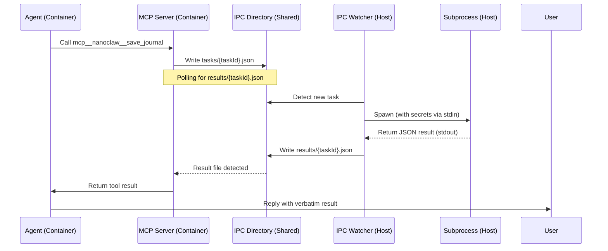

# Agent Tool Architecture (MCP & Task IPC)

This document describes how high-level agent commands (like `+journal` and `+dump`) are implemented using a combination of **MCP Tools**, **File-based IPC**, and **Host Subprocesses**.

## Overview

When an agent (running in a Docker container) needs to perform a privileged operation on the host (like writing to a vault or shortening a URL), it uses a multi-layer communication path:

1.  **Agent SDK**: The agent calls an MCP tool (e.g., `mcp__nanoclaw__save_journal`).
2.  **MCP Server**: The MCP server inside the container ([`container/agent-runner/src/ipc-mcp-stdio.ts`](container/agent-runner/src/ipc-mcp-stdio.ts)) receives the call and writes a **Task IPC file**.
3.  **IPC Bridge**: The task file is written to a shared volume mount, appearing on the host.
4.  **Host IPC Watcher**: The host ([`src/ipc.ts`](src/ipc.ts)) detects the task and spawns a **Subprocess**.
5.  **Subprocess**: A specialized script (e.g., `.claude/skills/journal/journal.ts`) performs the actual work (file I/O, API calls) and returns a JSON result.
6.  **Result IPC**: The host writes the result back to a specific results directory in the shared volume.
7.  **MCP Polling**: The MCP server inside the container polls for the result file, reads it, and returns the response to the agent.

## Data Flow Diagram



## Chain Tooling Pattern

Some complex tools use an atomic "chaining" pattern within the MCP handler to separate concerns. For example, `save_journal` doesn't just write a file; it also generates a URL and shortens it.

```text
MCP handler (ipc-mcp-stdio.ts)
  │
  ├─ ipcCall('journal')     → journal.ts (Writes file, returns vaultPath)
  ├─ ipcCall('vault_url')   → get_vault_url.ts (Converts path to full URL)
  └─ ipcCall('short_url')   → get_short_url.ts (Shortens URL via Shlink)
```

This allows individual host scripts to remain simple and focused on a single task (e.g., `journal.ts` only handles file I/O, not URL logic).

## Key Components

### 1. MCP Server ([`container/agent-runner/src/ipc-mcp-stdio.ts`](container/agent-runner/src/ipc-mcp-stdio.ts))
Registers tools and manages the IPC lifecycle (writing tasks, polling for results). It uses an `ipcCall()` helper to abstract the file-based communication.

### 2. IPC Dispatcher ([`src/ipc.ts`](src/ipc.ts))
The `processTaskIpc()` function on the host dispatches tasks based on their `type`. It handles secret injection by reading from `.env` and passing them to subprocesses via `stdin`.

### 3. Host Subprocesses
Specialized TypeScript scripts run via `tsx`.
- **Vault Writers**: `journal.ts`, `dump.ts`, `write_vault_file.ts`.
- **Vault Readers**: `search_vault.ts` (content/filename search across `/opt/vault`).
- **Utility Tools**: `get_vault_url.ts`, `get_short_url.ts`.

### 4. Vault Access: Two-Layer Design

NanoClaw agents have two complementary ways to access the Obsidian vault (`/opt/vault`). This layered design balances performance (zero-overhead reads) with discoverability (structured search).

#### Layer 1: Direct Read-Only Mount (Performance)
The vault is mounted into every container at `/workspace/vault` (read-only). Agents use native Claude Code tools directly:
- `Read /workspace/vault/journal/25-02-2026-journal.md`
- `Glob /workspace/vault/**/*.md`
- `Grep "query" /workspace/vault/`

**Benefit**: Zero IPC overhead. If the agent knows the path, it reads instantly.

#### Layer 2: `mcp__nanoclaw__search_vault` (Discovery)
For bounded discovery across the full vault when the exact path is unknown.
- **Parameters**: `query` (min 2 chars), `path` (optional subdir), `mode` (`content` | `filename`).
- **Returns**: Up to 20 matching files with up to 5 matching lines each (format: `L<n>: <text>`).
- **Implementation**: Recursive `.md` walker in `.claude/skills/vault/search_vault.ts` with path traversal protection.

**Benefit**: One IPC call returns multiple results with context, avoiding the 15s poll window overhead for multiple individual reads during discovery.

#### Caveats
- **Container rebuild required** for the MCP tool: `sudo docker buildx prune -f && sudo ./container/build.sh`.
- Search is bounded at 20 files / 5 lines per file.
- Only `.md` files are indexed by the search tool; other formats are readable via direct mount.

## Debugging & Troubleshooting

If a tool like `+journal` or `+dump` fails, check the following layers:

### Layer 1: Agent/Model Level
- **"Unknown skill" error**: The agent might be trying to use the `Skill()` tool instead of the MCP tool. Ensure the system prompt explicitly directs the agent to use `mcp__nanoclaw__*` tools.
- **Poisoned Session**: If an agent fails once, it may "learn" that it doesn't have the tool. Reset the session in the database and archive the `.jsonl` log to force a fresh start.

### Layer 2: Container/MCP Level
- **Permission Denied**: Ensure the `*_results/` directories exist in the group's IPC directory and are writable (777) by the container user (UID 1000).
- **Stale Code**: Changes to `ipc-mcp-stdio.ts` require a container rebuild (`./container/build.sh`) and a sync to the group's session directory.

### Layer 3: Host/IPC Level
- **`ts-node: not found`**: The host uses `tsx` to run scripts. Ensure the absolute path to `node_modules/.bin/tsx` is used in `spawn()` calls.
- **Timezone Issues**: If timestamps are wrong (UTC instead of local), ensure the `TZ` environment variable is NOT passed as an empty string to the subprocess, allowing it to fall back to `/etc/localtime`.

### Layer 4: Subprocess Level
- **Secrets**: Verify that the required secrets (e.g., `NOTES_URL`, `SHLINK_API_KEY`) are present in the host's `.env` and whitelisted in `src/ipc.ts`.

## Best Practices: Multi-Step Tasks & Feedback

When an agent performs long-running or multi-step tasks (e.g., reading multiple journals, summarizing, and writing to a vault), it can appear to "hang" because the host only displays the agent's final result.

To ensure a good user experience, agents should follow these patterns:

### 1. Mandatory Progress Feedback
Always use `mcp__nanoclaw__send_message` to acknowledge the task *before* starting any long-running tool calls.
- **Example**: "Ugh, fine. Reading your boring journals now..."

### 2. Explicit Vault Write Workflow
When writing summaries or research results to the vault, follow this 6-step sequence:
1.  **Acknowledge**: Call `mcp__nanoclaw__send_message` to let the user know work has started.
2.  **Work**: Perform the research, reading, or summarization.
3.  **Write**: Call `mcp__nanoclaw__write_vault_file` with the non-empty content.
4.  **URL Chain**: Call `mcp__nanoclaw__get_vault_url` followed by `mcp__nanoclaw__get_short_url`.
5.  **Confirm**: Call `mcp__nanoclaw__send_message` with the short URL and a brief confirmation.
6.  **Finalize**: Provide a minimal final text response (since the main result was already sent).

### 3. Content Validation
Never call `write_vault_file` with empty content. If no data was found or generated, inform the user via `send_message` and stop the workflow.
